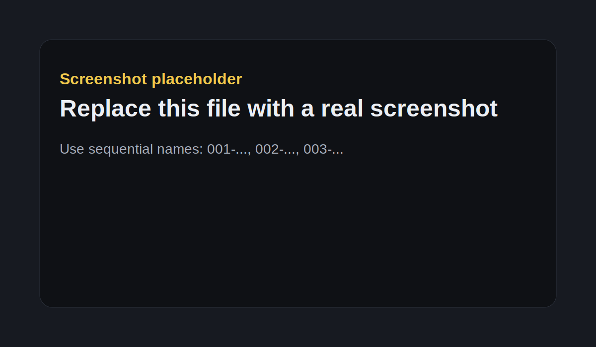

This note is about ownership evidence, not automatic ownership assignment.

The weak point in many Entra and Azure reviews is not detection. Detection is usually already available. The weak point is accountability before remediation.

## Evidence signals

Useful signals include:

- explicit app owners
- Azure resource tags
- resource group and subscription context
- RBAC assignments around related resources
- managed identity linkage
- deployment and activity history
- naming conventions
- group ownership

## Confidence model

A simple starting point:

| Signal | Confidence |
|---|---:|
| explicit ownership tag | high |
| application owner | medium |
| RBAC context | low |
| naming pattern only | low |

## Screenshot convention

Put screenshots in the same folder as this file:

```text
content/notes/entra-ownership-evidence-signals/
  index.md
  001-azure-resource-tags.png
  002-entra-app-owners.png
```

Then reference them normally:

```md

```



## Practical conclusion

Do not sell this as a generic scanner. The useful claim is narrower: evidence trail before remediation.
